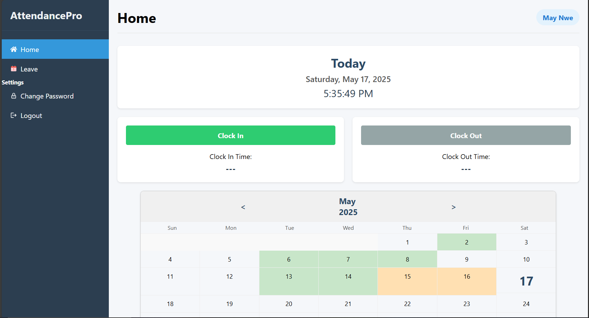
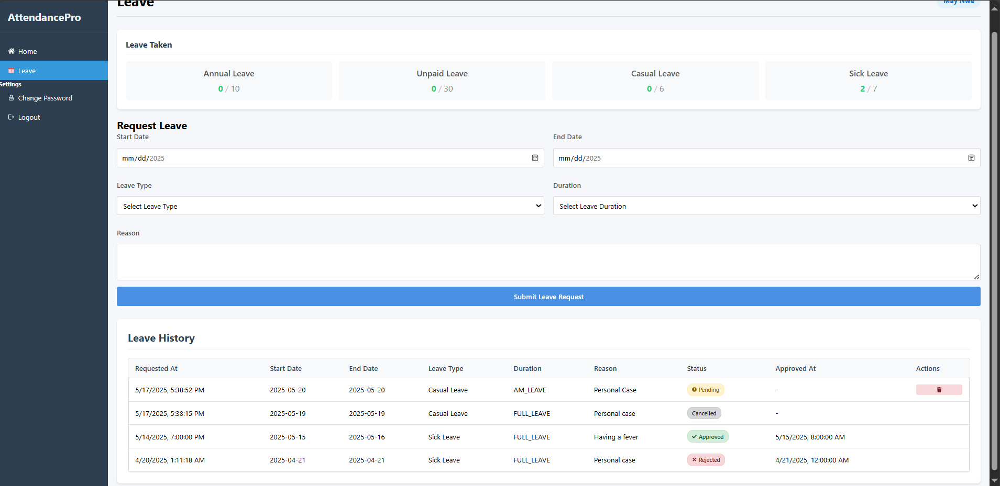
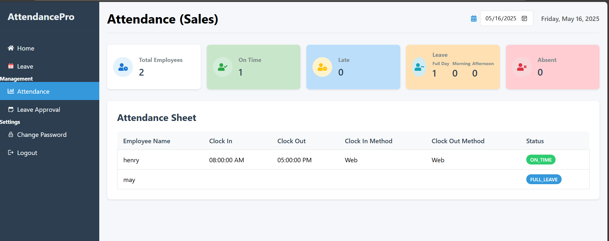
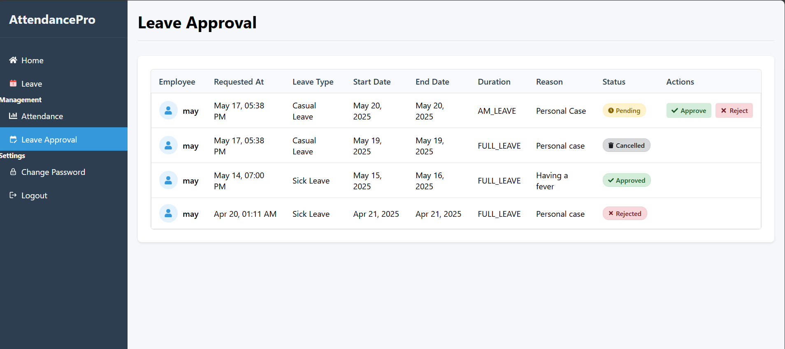
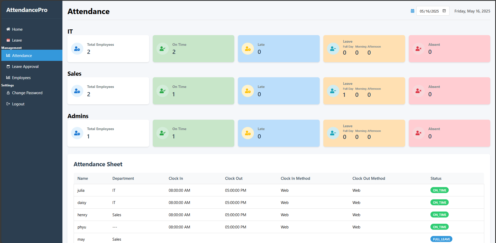
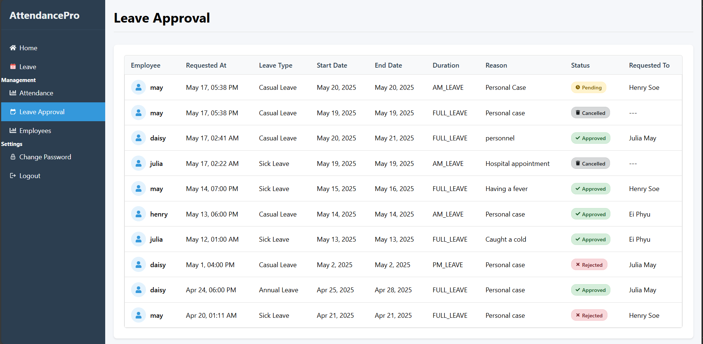
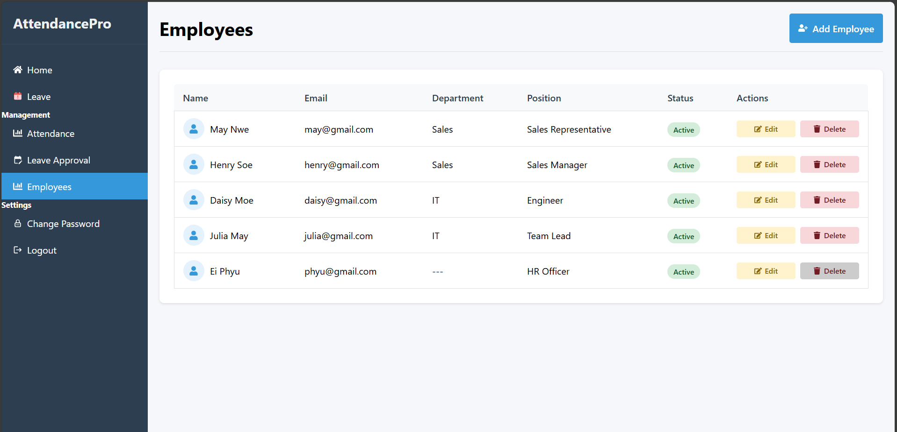

# 🕒 Employee Attendance System

A full-featured **Employee Attendance System** built with **Django**, **React.js**, and **PostgreSQL**. It provides role-based access for **Admin**, **Manager**, and **Staff** users, with a focus on attendance tracking, leave management, and department-wise insights.

---

## Features

### Shared Features (All Roles)
- ✅ Clock In / Clock Out
    - ⏰ Employees are marked as **LATE** if they clock in **after 8:15 AM**, allowing a 15-minute grace period beyond the official start time of 8:00 AM.
- 📅 View attendance calendar (🟩On-Time, 🟦Late, 🟧Leave)
- 📝 View leave taken by type (e.g., Sick, Casual, Annual)
- 📤 Submit leave requests 
- ❌ Cancel leave requests before approval/rejection
- 📚 View leave request history
- 🔐 Change password

### Manager Features
- 📊 View departmental attendance summary (Total Employees, On-Time, Late, Leave)
- 🗓️ View daily attendance details for their department
- ✔️ Approve or ❌ Reject leave requests from staff

### Admin Features
- 📝 Admins' own leave requests are auto-approved if not submitted to a designated reviewer.
- 🏢 Admin users may or may not belong to a specific department. The system supports both use cases.
- 🌍 View attendance and leave records across all departments
- 👥 View leave request history
- ➕ Add new employees
- ✏️ Edit employee data (except username, email, password)
- 🗑️ Delete employees (Admin accounts cannot be deleted)

---

## Known Limitations

📆 Currently, the system counts leave days without excluding weekends (Saturday and Sunday) but public holidays are not handled yet.

---

## Future Enhancements
- 🔐 Forgot Password Functionality – Allow users to reset their password via email.
- 📆 Public Holiday Integration – Exclude public holidays from leave.
- 📊 Analytics Dashboard – Show graphs for attendance trends, late statistics, leave types over time.
- 📧 Email Notifications – Notify managers and staff when a leave request is submitted, approved, or rejected.
- 🧾 Downloadable Reports – Export attendance and leave data as PDF/CSV.
- 📍 Geolocation Clock-In (GPS) – Ensure users clock in from valid physical locations.
- 💰 Payroll Integration – Generate monthly salary reports based on attendance

---

## Tech Stack

- Serving Django applications
- React.js | CSS
- PostgreSQL

---

## Getting Started

### 1. Clone the Repository

```bash
git clone https://github.com/ei-thandar-phyu/employee-attendance-django-pj.git
```

### 2. Setup PostgreSQL Database
- Setup PostgreSQL and update the following values in **settings.py**:
```python
DATABASES = {
    'default': {
        'ENGINE': 'django.db.backends.postgresql',
        'NAME': 'your_database_name',
        'USER': 'your_database_user',
        'PASSWORD': 'your_database_password',
        'HOST': 'localhost',
        'PORT': '5432',
    }
}
```

### 3. Backend Setup (Django)
```bash
cd backend
python -m venv env
env\Scripts\activate
pip install -r requirements.txt
python manage.py makemigrations
python manage.py migrate
python manage.py createsuperuser
python manage.py runserver
```

### 4. Frontend Setup (React)
```bash
cd frontend
npm install
npm start
```

---

## Usage Instructions

- Create a superuser – this will automatically have the Admin role.
- Login to the system as Admin.
- Add employees and assign them roles (Manager or Staff).
- Users can then:
  - Clock in/out
  - View attendance/leave records
  - Submit and track leave requests
  - Change their password

##  Watch Demo Video
🎥 [Watch Demo Video](screenshots/EmployeeAttendanceSystem_Testing.mkv)

## Screenshots

Here are a few key pages from the system. 📸 **See more screenshots in the [`screenshots/`](./screenshots) folder.**

### 🏠 Home


### 📝 Submit Leave Request & View History


### 📊 Department Attendance Overview (Sales Manager View)


### 🗂️ Review & Approve Leave Requests (Manager View)


### 🏢 Company-Wide Attendance Overview (Admin View)


### 📝 Leave Approval (Admin View)


### 👥 Employee Management (Admin View)



